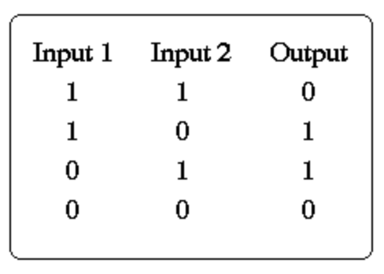
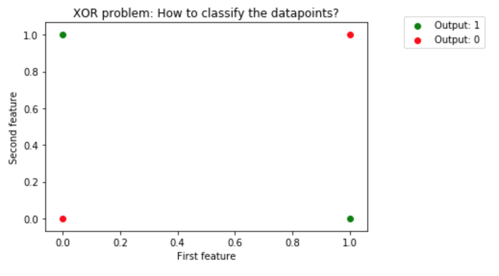
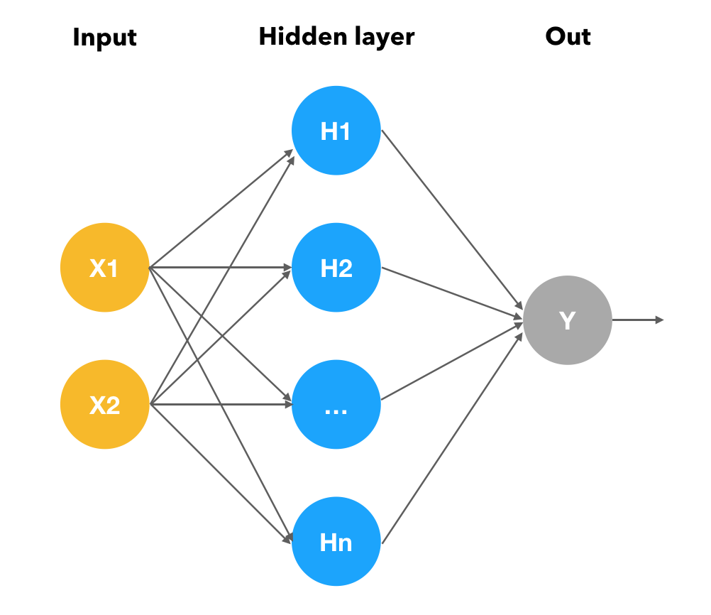

### Summary

The "Exclusive OR problem" is a classic problem in which the goal is to train a neural network to predict the outputs 
of XOR gates given two binary inputs. 
The XOR function should return **True** if these two inputs are not equal and **False** if they are equal. 
These are all the possible inputs and corresponding outputs:

  

  
  
The problem can also be illustrated in a plot, which makes it easier to see that the datapoints are not linearly separable (one straight line can never separate the red from the green dots): 

  

Below is a visualization of the neural network that was used for the scripts in this repository: it consists of two input neurons, one hidden layer (with multiple neurons) 
and one output node that can take value 0 or 1.  

Neural nets were trained with PyTorch, Tensorflow Eager (TFE) and Keras. 
In contrast to the "classic" TensorFlow, TensorFlow's eager execution evaluates operations immediately, without having to build the graph first, similar to PyTorch. This makes it easy to try out different things and inspect your graph while building it.  

  

